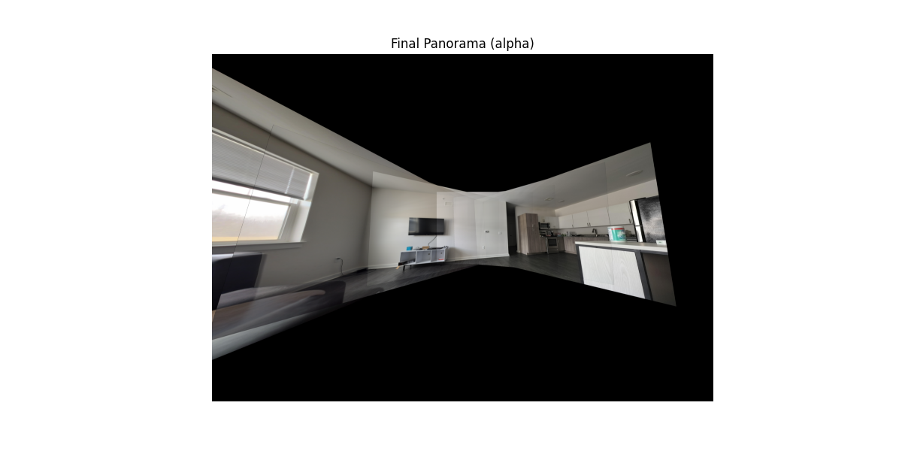
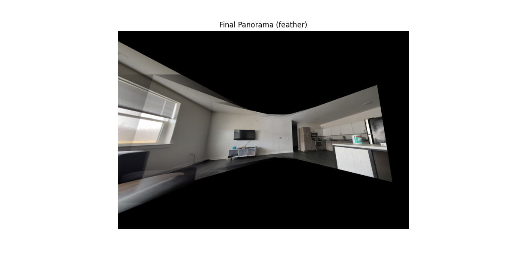
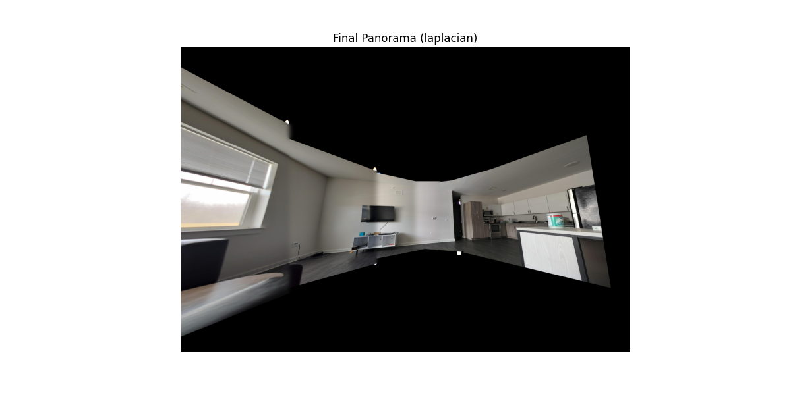
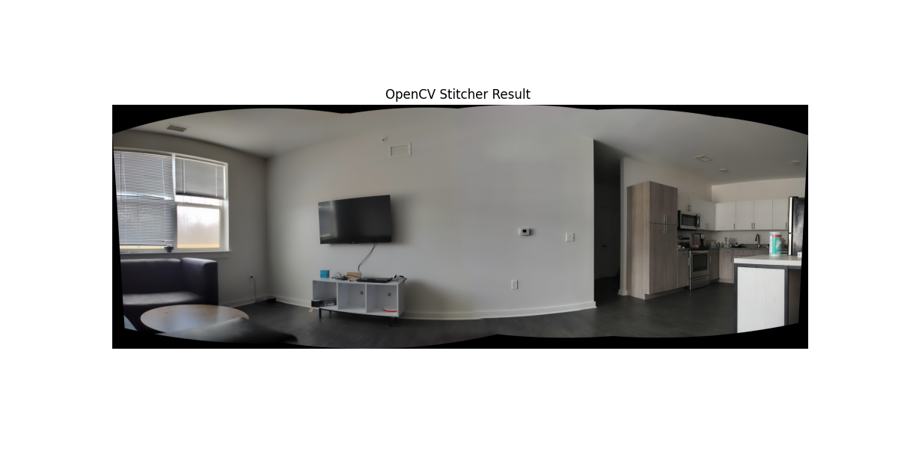
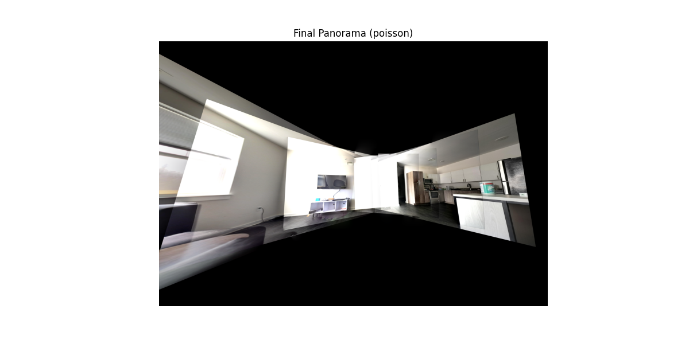

# Image Stitching and Blending Techniques

This repository demonstrates various blending techniques for panoramic image stitching. The **Images/** folder contains sample results produced by each method, including both day and night images. You can use these images directly or replace them with your own images for stitching.

## Table of Contents
1. [Overview](#overview)  
2. [Code Structure](#code-structure)  
3. [Blending Techniques](#blending-techniques)  
4. [Usage](#usage)  
5. [Results and Discussion](#results-and-discussion)

---

## Overview

Panoramic image stitching typically involves:
1. **Feature Detection and Matching**: Identifying keypoints and matching them across overlapping images (e.g., using SIFT and FLANN).  
2. **Homography Estimation**: Calculating the transformation matrix to align overlapping areas.  
3. **Warping and Blending**: Transforming images into a common coordinate system and merging them seamlessly.

This repository shows how different blending techniques can impact the final panorama. We also include an example using the built-in OpenCV Stitcher module.

---

## Code Structure

- **image_stiching_openCV.py**  
  Uses the OpenCV Stitcher module to automatically detect, match features, and blend images into a panorama. Internally, OpenCV’s Stitcher typically employs:
  - Feature detection and matching (e.g., ORB, SURF, or AKAZE).
  - Robust homography estimation (RANSAC).
  - A multi-band blending approach for seamless stitching (by default).

- **Custom Stitching Code (SIFT + FLANN + Custom Blending)**  
  - Implements SIFT (Scale-Invariant Feature Transform) for feature detection.
  - Uses FLANN (Fast Library for Approximate Nearest Neighbors) for feature matching.
  - Demonstrates different blending techniques (alpha, feather, Laplacian, Poisson) after images are warped and aligned.

- **Images/**  
  - Contains sample images (day and night sets) and the resulting panoramas:
    - **Alpha** blending result
    - **Feather** blending result
    - **Laplacian** blending result
    - **Poisson** blending result
    - **OpenCV** Stitcher result

You can either use the provided images or replace them with your own. Make sure the images you want to stitch are placed in the same directory as the code or update the file paths accordingly.

---

## Blending Techniques

Below is a short description of each blending technique demonstrated:

1. **Alpha Blending**  
   - A simple linear blending approach.  
   - Uses a weighted average of pixel intensities at the overlap (e.g., `I = α * I1 + (1 - α) * I2`).  
   - Easy to implement but can show ghosting if there’s slight misalignment or exposure differences.

2. **Feather Blending**  
   - An improved version of alpha blending that applies a smooth transition near the seam.  
   - Often uses distance maps or masks to reduce visible seams.  
   - Better than plain alpha blending at hiding stitching boundaries, but still sensitive to large intensity differences.

3. **Laplacian Blending**  
   - A multi-scale approach that decomposes images into frequency bands (Laplacian pyramids).  
   - Blends each band separately, then reconstructs the final image.  
   - Handles exposure differences better and generally produces smoother transitions.

4. **Poisson Blending**  
   - A gradient-domain approach that adjusts pixel intensities to match gradients between overlapping regions.  
   - Can produce seamless color transitions but may introduce artifacts if the alignment is off or if the color differences are very large.

5. **OpenCV Stitcher (Multi-band Blending)**  
   - Uses OpenCV’s built-in pipeline for matching, homography, and blending.  
   - Typically employs a multi-band blending technique internally, similar to Laplacian pyramids, to minimize seam visibility.  
   - Often robust and convenient, but you have less direct control over the blending parameters.

---

## Usage

1. **OpenCV Stitcher**  
   - Run `python image_stiching_openCV.py`  
   - This will attempt to read images (default or specified) and produce a stitched panorama using OpenCV’s internal methods.

2. **Custom Stitching (SIFT + FLANN + Blending)**  
   - Place your images (or use the provided ones) in the same folder as the script or adjust the file paths accordingly.  
   - Run the custom script (e.g., `python your_custom_stitching_script.py`).  
   - The script will detect and match features using SIFT + FLANN, estimate the homography, warp images, and apply the specified blending method.

---

## Results and Discussion

Below are the sample results from the **Images/** folder, showcasing each blending technique:

### Alpha Blending Result

- **Observation:** Some ghosting and visible seams, especially where there is motion or lighting differences.

### Feather Blending Result

- **Observation:** Smoother transitions compared to alpha blending, though small intensity differences may still be noticeable.

### Laplacian Blending Result

- **Observation:** Generally produces uniform transitions, handling exposure differences better.

### OpenCV Stitcher Result

- **Observation:** Leverages robust multi-band blending internally to produce a good overall panorama with minimal seams.

### Poisson Blending Result

- **Observation:** Can yield seamless color transitions, but may introduce artifacts if the images are not perfectly aligned.

Feel free to experiment with your own images—daytime, nighttime, or any scene you like. The final results may vary depending on factors such as image overlap, exposure differences, and the presence of moving objects.

---

**Enjoy experimenting with panoramic stitching!** If you have any questions or encounter issues, please reach out or open an issue in the repository.
